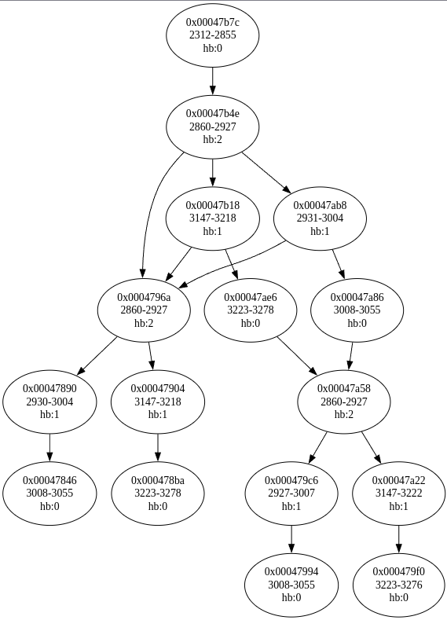

# Zorton Brothers reverse
Intento de hacer un poco de ingenieria inversa de el arcade de Zorton Brothers.

# Video dump
El vídeo ripeado por los grandes de Recreativas.org  puedes encontrarlo aquí:
https://archive.org/details/los-justicieros-zorton-brothers-picmatic-1993-cav-pal-spanish


# Visualizer
En el directorio ./visualizer está el programa hecho por [havi](https://github.com/klavman) para ver los frames y rangos de frames del vídeo.
para ejecturarlo:

```bash
cd visualizer
uv run main.py
```
Ten encuenta que el vídeo deberás tenerlo descargado previamente.


# Ghidra
En esta version estamos usando ghidra 10.3.1. con el plugin para desensamblar Amiga500 y cargar el formato ejecutable de Amiga Hunk.
https://github.com/lab313ru/ghidra_amiga_ldr


# Directorio test_python
En este directorio estamos guardando los scripts que estamos desarrollando para extraer la estructura de los datos.

# Estructura del JSON
El archivo `Zorton_brothes_v1.01.json` contiene la estructura completa del juego parseada desde el binario de Amiga.

## `scene_order`
Array con las direcciones de memoria de las escenas en orden de juego (0-25 son las escenas principales del juego).

## `chunks`
Array de escenas del juego. Cada escena contiene:

- **`id`**: Identificador de la escena
- **`file_offset`** / **`mem_offset`**: Posiciones en archivo y memoria
- **`frames`**: Lista de frames del laserdisc utilizados
- **`nodes`**: Árbol de decisiones de la escena

## Estructura de un nodo (`tree_logic_node`)
```javascript
{
        "type": "tree_logic_node",
        "mem_offset": "0x...",
        "value": {
                "ptr_frame_start": "frame inicial",
                "ptr_frame_end": "frame final", 
                "ptr_frame_hitbox_start": "frame donde el hitbox se activa",
                "ptr_frame_hitbox_end": "frame donde el hitbox termina",
                "lista_hitboxes": [/* hitboxes interactivos */],
                "sequences": [
                        "0x00000000",
                        "0x...",
                        "0x...",
                        // ...
                ],
                "ptr_node_respawn": "0x..." 
        }
}
```

- `0x0004c7d2`: Nodo de muerte (death_and_destruction ☠️)
- `0x0004c7fc`: Nodo de finalización/transición
- `0x00000000`: Nodo terminal

## `spare_chunks`
Nodos parseados pero no referenciados en las escenas principales (muertes alternativas, secuencias sin usar, etc.).

## Formato de la estructura

```c
struct chunk {
                frame *ptr_frame_start;           // frame donde empieza la secuencia
                frame *ptr_frame_end;             // frame donde termina
                frame *ptr_frame_hitbox_start;    // frame donde el hitbox se activa
                frame *ptr_frame_hitbox_end;      // frame donde el hitbox termina
                hitbox *ptr_hitbox;               // puntero al hitbox
                frame *ptr_frame_unk;             // frame desconocido
                chunk *ptr_node_respawn;          // checkpoint (continue point)
                
                int_8 field_0;                    // desconocido
                int_8 field_1;                    // desconocido
                int_8 type_a;                     // tipo/flags
                int_8 type_b;                     // tipo/flags
                int_8 num_sequences;              // número de secuencias
                int_8 type_d;                     // desconocido
                void *ptr_fn_callback;            // función callback
                chunk **ptr_list_sequences;       // lista de punteros a chunks
}
```

## Navegación por el grafo
El juego funciona como un árbol de decisiones donde:

- Cada nodo reproduce un rango de frames del laserdisc
- Durante ciertos frames, se activan hitboxes
- Según el input del jugador (o falta de él), se salta al siguiente nodo vía `sequences`
- Los paths exitosos llevan eventualmente a nodos terminales o a la siguiente escena
- Los paths de fallo/timeout llevan a nodos de muerte (☠️)

